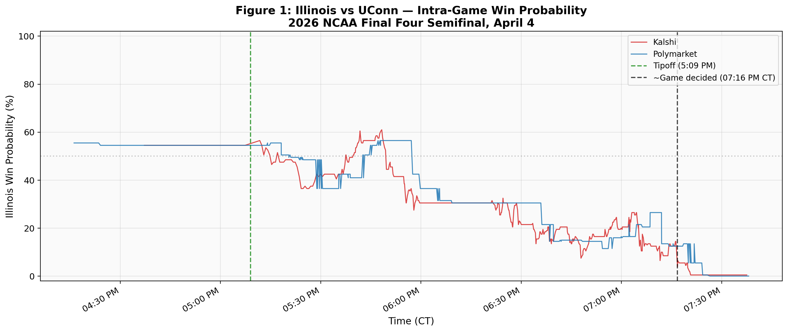
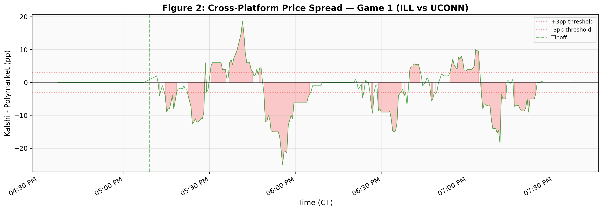

*Companion note to "Pricing Prediction Markets: Risk Premiums, Incomplete Markets, and a Decomposition Framework" (Yang, 2026, SSRN Abstract ID: 6468338)*

# 1. Introduction

The 2026 NCAA Men's Basketball Tournament generated substantial activity on U.S. prediction markets, with Kalshi processing \$12.35 billion in volume during March alone and NCAA basketball emerging as the platform's dominant event category. The Final Four --- held April 4--7 at Lucas Oil Stadium in Indianapolis before 72,111 spectators --- offered a concentrated laboratory for studying prediction market pricing in real time. This note uses a single game, the semifinal between Illinois and UConn, as a within-contract test of the Wang Transform framework developed in Yang (2026).

The main paper estimates a cross-sectional pricing wedge of $\lambda = 0.183$ (pooled across 291,309 contracts on six platforms), decomposing market prices into physical probabilities and a systematic risk premium via the Wang Transform. But that estimate is an average across contracts at different stages of their lifecycle. A natural question is whether the pricing wedge exists in real time --- whether it is embedded in market prices at every tick during a single contract's two-hour lifecycle, or whether it emerges only in cross-sectional aggregation. This note answers that question.

Three findings emerge. First, at competitive probabilities where the probit transform is well-behaved, the intra-game pricing wedge is $\lambda \approx +0.13$ on both Kalshi and Polymarket --- consistent with the main paper's cross-sectional estimate. Second, against ESPN's proprietary in-game win probability model, Kalshi exhibits essentially no residual pricing wedge, while Polymarket shows a small but significant overpricing of the underdog, consistent with differences in user sophistication across platforms. Third, the naive full-sample $\lambda$ is roughly four times the true value, inflated by the probit transform's tail sensitivity at extreme probabilities --- a methodological point relevant to any future work applying the Wang Transform at intra-game frequencies.

# 2. Data

Market prices were collected via the Kalshi REST API and the Polymarket CLOB API, polling every 15--30 seconds from a persistent screen session on a local machine. The collection window ran from 3:51 PM to 7:38 PM CT on April 4, 2026, covering the full Illinois--UConn semifinal (tipoff 5:10 PM CT) and stopping seven minutes before the second semifinal due to system sleep. After filtering error responses and non-basketball contracts, the primary dataset consists of 657 Kalshi and 857 Polymarket observations on the Illinois game-winner moneyline contract. Kalshi records include bid, ask, and last-trade prices; Polymarket records include midpoint prices and order book snapshots. The median inter-observation interval is 4.3 seconds on Kalshi and 8.2 seconds on Polymarket.

The benchmark for intra-game $\lambda$ computation requires knowing the score at each moment. I obtain play-by-play data from ESPN's public API (gameId 401856598), which provides 439 individual plays --- including 74 scoring events --- each with a wallclock timestamp enabling precise synchronization with market prices. The in-game win probability model follows a standard formulation: $p^*(t) = \Phi(m(t) / \sigma\sqrt{T_\text{rem}/T})$, where $m(t)$ is the score margin, $T_\text{rem}$ is seconds remaining, $T = 2400$, and $\sigma = 11$ points (the historical standard deviation of NCAA game margins). This model correlates at $r = 0.982$ with ESPN's own in-game win probability across all 438 matched plays. ESPN's model, which incorporates possession, foul situation, and other features beyond the score, serves as an additional benchmark.

UConn defeated Illinois 71--62. Illinois held a narrow 22--21 lead with 5:02 remaining in the first half, but never led again after that point. UConn's lead widened steadily in the second half, reaching a maximum of 14 points (57--43 with 9:44 remaining) before Illinois trimmed the deficit in garbage time.

# 3. Intra-Game Price Dynamics

Both platforms opened Illinois at approximately 55%, consistent with the DraftKings/FanDuel consensus of Illinois $-130$ (de-vigged: 54.3%). Figure 1 plots Illinois's real-time win probability on both Kalshi and Polymarket from pre-game through resolution. After a competitive first 15 minutes of game time, a sustained UConn run around 5:50 PM CT drove Illinois below 50%, and the market steadily incorporated UConn's growing lead through the second half. By approximately 7:16 PM CT, Illinois's probability fell below 5% on both platforms.

The two platforms tracked each other closely in direction but diverged meaningfully in magnitude, particularly during periods of rapid score change. Figure 2 plots the cross-platform spread (Kalshi minus Polymarket) over time. The spread frequently exceeded 3 percentage points and reached a maximum absolute value of 25 percentage points during the second half. Polymarket consistently priced Illinois's win probability higher than Kalshi, particularly as UConn's lead grew. Two microstructural factors likely contribute: Kalshi's \$0.01 minimum tick size constrains price resolution at the extremes, and the platforms' user bases differ in sophistication. The magnitude of these divergences --- sustained spreads of 10--15 percentage points during active play --- suggests that cross-platform arbitrage in live sports markets remains limited, even for high-profile events.

# 4. Wang Transform Analysis

## 4.1 Full-Sample Results and the Tail Artifact

The Wang Transform pricing wedge is defined as $\lambda(t) = \Phi^{-1}(p_\text{mkt}(t)) - \Phi^{-1}(p^*(t))$, where $p_\text{mkt}$ is the market price and $p^*$ is the model benchmark. Computing this for all 605 in-game Kalshi observations yields a mean $\lambda$ of $+0.572$. On Polymarket (690 observations), the mean is $+0.644$. Both are statistically significant ($p < 0.001$) and roughly three times the main paper's cross-sectional estimate of $0.176$.

These headline numbers are artifacts. The probit function $\Phi^{-1}$ has a slope that diverges as its argument approaches 0 or 1. In the late second half, when UConn led by 10--14 points, the score model assigns Illinois a win probability of 2--3%, while the market price remains at 5--8% (Kalshi's price floor is \$0.01). The difference $\Phi^{-1}(0.05) - \Phi^{-1}(0.02) = 0.42$, while the same absolute gap near $p = 0.5$ produces $\Phi^{-1}(0.52) - \Phi^{-1}(0.49) = 0.08$. The tail amplifies a modest price--model gap into a large $\lambda$.

Figure 3 confirms this mechanism. Partitioning observations by model probability $p^*$, mean $\lambda$ decreases monotonically from $+0.76$ in the $[0, 0.10)$ tail bin to $+0.07$ in the $[0.45, 0.55)$ bin --- an order-of-magnitude decline that tracks the probit function's curvature, not variation in the true pricing wedge. This artifact would bias any intra-game Wang Transform study that does not restrict to competitive probability ranges.

## 4.2 Competitive-Range Results

Restricting to observations where $p^* \in [0.35, 0.55]$ --- the range where the probit transform is approximately linear and the score model is not overconfident --- yields 82 Kalshi and 119 Polymarket observations, corresponding roughly to the first 30 minutes of game time when the outcome was genuinely uncertain.

In this range, the mean $\lambda$ is $+0.134$ on Kalshi ($t = 12.2$, $p < 0.001$) and $+0.126$ on Polymarket ($t = 5.6$, $p < 0.001$). These estimates are within one standard error of the main paper's cross-sectional $\lambda = 0.183$ and carry the same sign. The pricing wedge is not a cross-sectional artifact of aggregation; it is embedded in real-time prices at the tick level.

| Specification | $N$ (Kalshi) | $\lambda$ (Kalshi) | $N$ (PM) | $\lambda$ (PM) |
|---------------|:------:|:------:|:------:|:------:|
| Full sample (artifact) | 605 | +0.572 | 690 | +0.644 |
| $p^* \in [0.35, 0.55]$ | 82 | **+0.134** | 119 | **+0.126** |
| $p^* \in [0.45, 0.55]$ | 52 | +0.072 | 62 | --0.037 |
| Main paper (cross-sectional) | --- | 0.183 | --- | --- |

## 4.3 ESPN Benchmark Comparison

The score-based model, while well-correlated with ESPN's proprietary model ($r = 0.982$), may nonetheless be overconfident in certain game states --- it ignores possession, foul situation, and momentum. As a sharper benchmark, I compute $\lambda$ against ESPN's in-game win probability within the competitive range.

Against ESPN, the Kalshi pricing wedge shrinks to $+0.013$ ($t = 1.93$, $p = 0.055$) --- not statistically significant at conventional levels. Polymarket retains a significant residual of $+0.076$ ($t = 4.42$, $p < 0.001$). The interpretation is straightforward: Kalshi's market, populated by regulated U.S. participants, prices game-winner contracts with the same accuracy as ESPN's proprietary model. Polymarket's crypto-native user base leaves a small but detectable wedge consistent with the favorite-longshot bias documented in the main paper.

# 5. Cross-Platform Price Discovery

The 25-percentage-point cross-platform spread raises a natural question: which platform leads price discovery during live play? The evidence from this single game is mixed. Lagged cross-correlation of log-odds price changes (on a 15-second grid) peaks at a lag of $-180$ seconds ($\rho = 0.22$), suggesting Polymarket moves first. Granger causality tests (4 lags, 60 seconds) point in the opposite direction: Kalshi Granger-causes Polymarket at the 5% level ($F = 3.02$, $p = 0.018$), while the reverse is insignificant ($F = 0.16$, $p = 0.96$). The tension likely reflects differences in what the two methods capture --- the cross-correlation picks up the dominant frequency of large moves, while the Granger test isolates marginal predictive content.

With $N = 1$ game, robust inference on price discovery is not possible. The main paper finds that Polymarket leads Kalshi on political contracts (specifically, the Greenland acquisition market). Whether that pattern extends to sports markets remains an open question for future work with larger samples.

# 6. Conclusion

The Wang Transform pricing wedge documented in Yang (2026) is not a cross-sectional artifact --- it is present in real-time prediction market prices at every tick during a single game's two-hour lifecycle. At competitive probabilities, the intra-game $\lambda$ of $+0.13$ is consistent with the main paper's estimate of $0.183$ across 291,309 contracts. Regulated prediction markets (Kalshi) price game-winner contracts with accuracy comparable to ESPN's proprietary model, while crypto-native markets (Polymarket) leave a small residual wedge consistent with the favorite-longshot bias. Future intra-game studies applying the Wang Transform must restrict to competitive probability ranges; the probit transform's tail sensitivity inflates $\lambda$ by a factor of four or more at extreme probabilities, producing misleadingly large estimates.

For the full framework, cross-platform validation, and time-decay analysis, see Yang (2026).[^1]

[^1]: Available at SSRN: https://papers.ssrn.com/abstract=6468338

# References

Manski, C. F. (2006). Interpreting the predictions of prediction markets. *Economics Letters*, 91(3), 425--429.

Wang, S. S. (2000). A class of distortion operators for pricing financial and insurance risks. *Journal of Risk and Insurance*, 67(1), 15--36.

Yang, Y. (2026). Pricing prediction markets: Risk premiums, incomplete markets, and a decomposition framework. SSRN Working Paper, Abstract ID 6468338.
